# PX4 SITL on AWS — Automated Simulation & Testing Pipeline

This repository demonstrates an automated workflow for running PX4 SITL (Software-In-The-Loop) simulations on AWS infrastructure — fully managed by GitHub Actions.

Whenever code changes are made to any of the ROS 2 nodes, a new Docker image is built, containing the required environment to run the SITL simulation. Then, an EC2 instance is launched, pulls the simulation Docker image from ECR, and runs the scenario.

Once the simulation ends, a simple analysis script runs to count the number of messages per topic, helping to detect bugs or anomalies. Finally, the ROS 2 bag file that was recorded during the simulation is uploaded to an S3 bucket for storage and later analysis.

```mermaid
flowchart LR
    A[Code Change in ROS 2 Node] --> B[GitHub Actions Triggered]
    B --> C[Build New Docker Image]
    C --> D[Push Image to AWS ECR]
    D --> E[Launch EC2 Instance]
    E --> F[Pull Docker Image from ECR]
    F --> G[Run PX4 SITL Simulation]
    G --> H[Run Analysis Script]
    H --> I[Upload ROS 2 Bag File to S3]
    I --> J[Terminate EC2 Instance]

```




## 	Repository Contents

This repository contains:

- A devcontainer setup for develop offboard algorithms for PX4 flight stack, based on ROS 2 and XRCE-DDS.
- ROS 2 nodes implementing high-level logic for the [px4-offboard](https://github.com/Jaeyoung-Lim/px4-offboard) project by @Jaeyoung-Lim — handling mission control, behaviors, and simulation logic.
- Dockerfiles and scripts to build a complete PX4 SITL environment including PX4 Autopilot, ROS 2 workspace, and dependencies.
- GitHub Actions workflow to automate the entire simulation pipeline: build, deploy, simulate, and upload results.
- Infrastructure setup documentation for AWS (VPC, EC2, ECR, S3, IAM Roles).
- Example analysis scripts to inspect simulation results (ROS 2 bag file analysis).
- Ready-to-use example for cloud-based PX4 SITL testing pipeline integrated with ROS 2.

---

## Repository Structure

```graphql
p4_sitl_on_aws/ 
│── src/ # Contains all ROS 2 packages 
  ── px4-offboard
  ── px4_msgs
  ── px4_ci_aws
│── dockers/ # Docker images for building and running the SITL
│── scripts/ # Build, run, and deployment scripts 
│── docs/ # Documentation and setup guides
|── PX4-Autopilot # 
```

## Use Case

This repository provides an infrastructure example for:

- Automated testing of ROS 2 nodes in PX4 SITL.
- Running PX4 SITL on scalable AWS infrastructure.
- Offloading heavy simulations from local machines.
- Auto-uploading simulation output for post-processing.

---

## AWS Resources Required

| Resource        | Purpose                            | Example Name                |
|----------------|------------------------------------|-----------------------------|
| VPC             | Networking for EC2                | `px4-vpc`                   |
| EC2 Instance    | Run PX4 SITL simulation           | `c6i.2xlarge`               |
| ECR Repository  | Store simulation Docker image     | `px4_sitl_on_aws`           |
| S3 Bucket       | Store simulation output (bags)    | `px4-sitl-on-aws-bags`      |
| IAM Role        | Permissions for EC2 instance      | `px4_sitl_on_aws`           |

---


## Documentation

1. [Install](./docs/install.md)
2. [AWS Setup](./docs/aws_setup.md)


