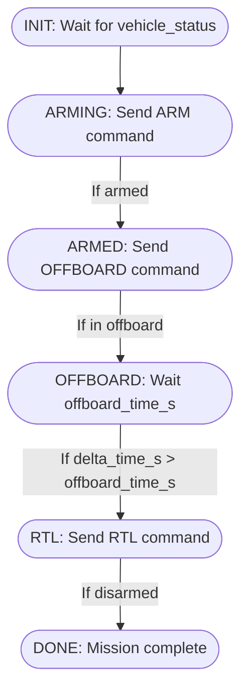

# PX4 State Machine Node

This document explains the logic and flow of the `px4_state_machine.py` ROS 2 node, which automates arming, offboard mode, and RTL (Return to Launch) for PX4 SITL.

## Overview

The node manages the following states:
- **INIT**: Waits for vehicle status.
- **ARMING**: Sends arm command.
- **ARMED**: Sends offboard command.
- **OFFBOARD**: Waits in offboard mode for a configurable time.
- **RTL**: Sends RTL command.
- **DONE**: Mission complete.

The time spent in OFFBOARD mode is controlled by the ROS 2 parameter `offboard_time_s` (default: 30.0s).

## Parameters
- `offboard_time_s` (double, default: 30.0): Time in seconds to stay in OFFBOARD mode before triggering RTL. Can be set via environment variable `OFFBOARD_TIME_S`.

## Logic Flow

## State Descriptions
- **INIT**: Waits for the first `vehicle_status` message.
- **ARMING**: Sends an arm command until the vehicle is armed.
- **ARMED**: Sends an offboard command until the vehicle enters offboard mode.
- **OFFBOARD**: Waits for `offboard_time_s` seconds in offboard mode.
- **RTL**: Sends RTL command once, waits for disarm.
- **DONE**: Mission is complete, node exits.

## Usage
- The node is launched via `ci.launch.py` and can be configured with the `OFFBOARD_TIME_S` environment variable.

---
*Generated on 2025-04-19*
